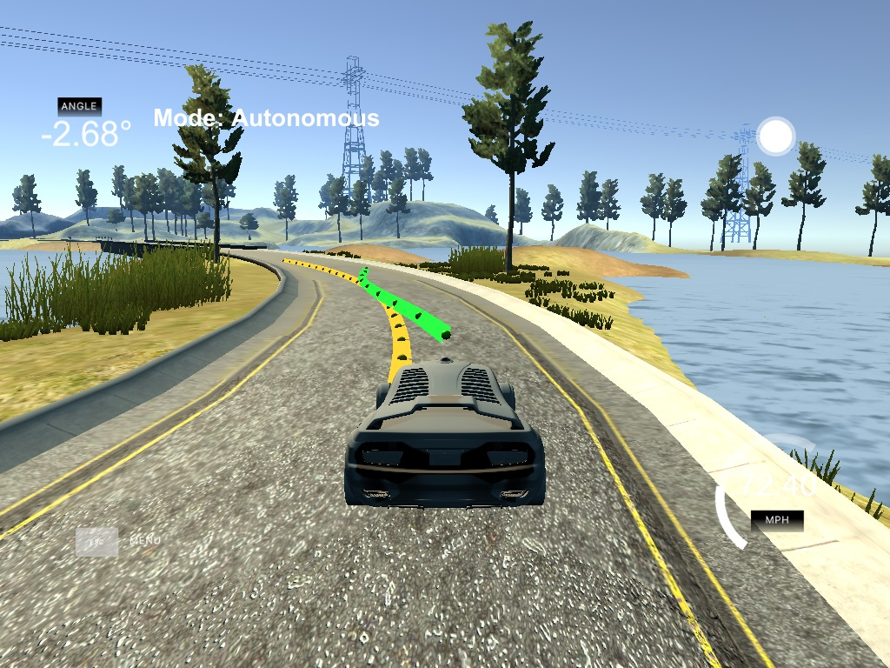

# CarND-Controls-MPC
Self-Driving Car Engineer Nanodegree Program

---

## The Model

### The State
The state is a vector of the input values of *x*, *y*, *psi*, *v*, *cte* and *epsi*. The *x*, *y* and *psi* values are translated from map coordinates to car coordinates. The *cte* and *epsi* are calculated from waypoints that are included in the input values from the simulator. 

### The Actuators
The actuators are the speed and throttle values, which are also included in the input values. The solver predicts the future trajectory of the car by predicting the future values of the actuators.

### Updating Equations

##### Latency
The variables and actuators are updated to take into consideration the latency that usually happens in real time scenarios. 
*x* is updated based on the car displacement due to velocity. *y* is 0 since any changes in *y* would be a *cte*. *psi* is updated with the change in steering angle and velocity, and the car constant *Lf*. *v* is updated with the change contributed by acceleration. *cte* is *y* value of *v* using angle *epsi*. And lastly, *epsi* is the change in the car angle.

##### Prediction
Running the state values to the Solver will give us the predicted values for the actuators as well as the new state. Using the coefficients of a third order equation calculated from the given waypoint values, we are able to predict the steering angle and throttle values for a future time step.

## Timestep Length and Elapsed Duration (N & dt)
The *N = 10* and *dt = 0.1* were the first values I tried based on the MPC Controller Walkthrough video. I have used *N = 20* and *dt = 0.05* separately, both of which showed a relatively better accuracy. I have used them for runs with higher velocity and they worked perfectly. But since I prefer my code to run faster, I compromised to use one of the former values and stuck with *N = 10* and *dt = 0.05*. I might try higher values of *N* and lower values of *dt* for racing levels probably.

## Polynomial Fitting and MPC Preprocessing

###  Transformation of Car Coordinates
Translation and rotation of the coordinate values helps to simplify the computation. In doing this, *px = 0, py = 0* and *psi = 0*. The equations for *polyeval* for *cte* and *epsi*, as well as the equations for computing latency have some of the terms zeroed out and shortened. 
.    
### Polynomial Fitting
Since the waypoints were translated and rotated, the resulting values were the ones fed into polyeval to get the coefficients. *Order = 3* is used since it'll fit most curves. The actuators, on the other hand, was left with no preprocessing done.

## Model Predictive Control with Latency
In solving the MPC with latency, the sleep function was used for 0.1 seconds to simulate latency. The latency equations are simply the same predictive equations used to determine the position of the vehicle at a future time step. The resulting latency values are used in the Solver for MPC which gave the corrected position of the vehicle: the position after the latency period.  

## Simulation
By using *N = 10, dt = 0.1* and several cost function multipliers for fine tuning the Solver, the car was able to finish a whole lap around the track at **max speed of 72 mph**. Given more time, I'm sure those values can be improved. Below is a video of the lap done.

